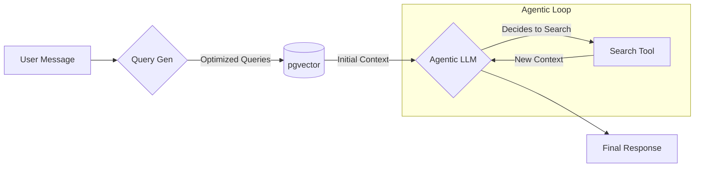

# Retrieval-Augmented Generation (RAG)

Diamond LLM uses a specialized RAG system to deliver context-aware answers from your internal documentation.

## 🧩 Architecture

The pipeline consists of four main stages:

1.  **Ingestion**: Guides are written in Markdown.
2.  **Processing**: Text is split recursively using `langchain`.
3.  **Embedding**: Vectors are generated via Ollama/Gemini.
4.  **Proactive Retrieval**: System generates queries and fetches initial context.
5.  **Agentic Refinement**: The LLM (Agent) analyzes the context and uses tools to search for missing details if necessary.



## ✨ Key Features

### 🔍 Dual-Layer Retrieval
Diamond LLM combines two powerful retrieval strategies:
1.  **Proactive Search**: Before the LLM starts, the system analyzes the user's intent, generates targeted questions, and fetches relevant documentation.
2.  **Agentic Search (Tools)**: The LLM is equipped with a `search` tool. If the initial context is insufficient, it acts as an agent, autonomously querying the database for more specific information.

### Hybrid Search & Boosting
(Static RAG)
We don't rely solely on cosine similarity. The search algorithm scores based on:
- **Vector Similarity**: Semantic match (cosine distance).
- **Number Boosting**: Penalty/Reward for matching numerical identifiers (critical for error codes like `500` or `v2`).
- **Keyword Matching**: Basic text overlap.

### Source Attribution
Every answer cites its sources. The `Sources` component links directly to the originating Guide, ensuring transparency.

### Asynchronous Queue
Embedding generation is computationally expensive. We handles this via **BullMQ**:
- **Non-blocking**: Saving a guide is instant.
- **Robust**: Retries and error handling for failed embeddings.
- **Scalable**: Workers can be scaled independently.

## ⚙️ Configuration

Ensure your `.env` connects to an embedding-capable model provider.

```bash
# Model Provider
OLLAMA_BASE_URL="http://127.0.0.1:11434/api"
```

> [!NOTE]
> The system automatically skips chunks that are too short to contain meaningful information.
